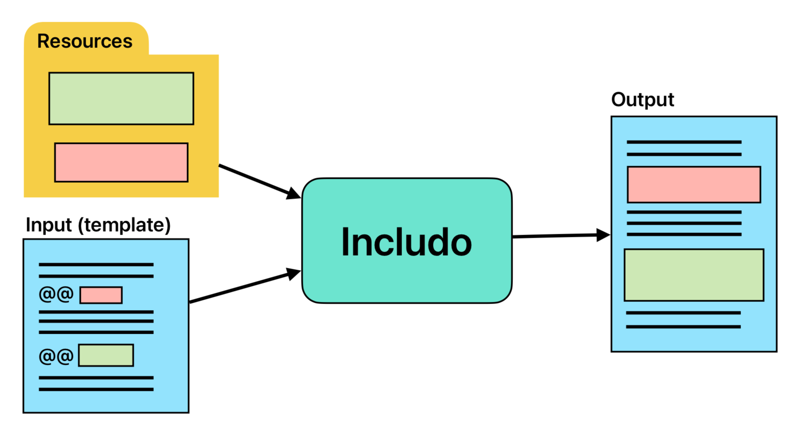

<!--- Comments are Fun --->

# includo

A simple file insertion preprocessor for text-based files. Inserts files (or their parts) to the resulting file.  
It is great for keeping your documentation up-to-date.

## General Usage

1. Make a template from your documentation - by adding `@@ ` lines with (at least) a file name you want to include to it.
2. Run `includo` command line app over it.
3. Check the result.  
   In general, those lines starting with `@@ ` will be replaced by the file content (or its part).

## Features

- **Simple** & easy to use  
  The less features the better.
- **Do one thing**: include files only  
  There are full-blown preprocessors already.
- Extensive **error checks**,  
   to prevent missing or wrong parts in auto-generated documentation.
- **CI** friendly  
  Works well within a **pipeline**.
- Language **agnostic**  
  Not only for js & markdown.



## Installation

TBD...

## Example 1: full insertion

We want the content of the file `middle.txt` to be included in a resulting file `rhymes.txt`:

1. `middle.txt` content:

```
@@ examples/example_1/middle.txt
```

2. Make a template `rhymes.template.txt`, which contains inclusion instruction line.

`rhymes.template.txt`:

```
@@ examples/example_1/rhymes.template.txt
```

3. Process the template with `includo` app to generate the `rhymes.txt` result:

```sh
@@ examples/example_1/run.sh : Generate
```

4. Result (`rhymes.txt`):

```
@@ examples/example_1/rhymes.txt
```

The source of this example can be found at [examples/example_1/](examples/example_1/)

## Example 2: partial insertion

We want the `inc` method from `my-lib.js` to be included in `api.md`:

1. `my-lib.js` content:

```js
@@ examples/example_2/my-lib.js
```

There are two named parts: `inc` and `inc-example`, hidden behind `//<` comments.

2. In a file `api.template.md`, there is a `@@ ` line that contains a 'link' to that `inc` part of `my-lib.js` file.

<!-- prettier-ignore -->
~~~
@@ examples/example_2/api.template.md
~~~

3. Process the template with `includo` app to generate the `api.md` result:

```sh
@@ examples/example_2/run.sh : Generate
```

4. Result (`api.md`):

<!-- prettier-ignore -->
~~~
@@ examples/example_2/api.md
~~~

The source of this example can be found at [examples/example_2/](examples/example_2/)

## Command Line Help

```
@@ examples/assets/help.txt
```
